# Conclusions of grpc's load balancing

## 只使用 k8s service

grpc 服务定义如下：

```proto
syntax = "proto3";

message HelloRequest {
    string name = 1;
}

message HelloReply {
    string message = 2;
}

service Greeter {
    rpc SayHello(HelloRequest) returns (HelloReply) {}
}
```

服务端：

```python
from concurrent import futures
import logging
import socket
import os

import grpc

import helloworld_pb2
import helloworld_pb2_grpc

def get_local_ip():
    if os.getenv("IP"):
        return os.getenv("IP")
    hostname = socket.gethostname()
    local_ip = socket.gethostbyname(hostname)
    return local_ip

DEFAULT_PORT = 50051

def get_port():
    return os.getenv("PORT", DEFAULT_PORT)

LOCAL_IP = get_local_ip()
PORT = get_port()

class Greeter(helloworld_pb2_grpc.GreeterServicer):

    def SayHello(self, request, context):
        print(f"name: {request.name}")
        return helloworld_pb2.HelloReply(message=f"Hello, {request.name}!, I am {LOCAL_IP}:{PORT}")

def serve():
    server = grpc.server(futures.ThreadPoolExecutor(max_workers=10))
    helloworld_pb2_grpc.add_GreeterServicer_to_server(Greeter(), server)
    server.add_insecure_port(f'[::]:{PORT}')
    server.start()
    server.wait_for_termination()


if __name__ == '__main__':
    logging.basicConfig()
    serve()
```

客户端：

```python
from __future__ import print_function
import logging
import time

import grpc

import helloworld_pb2
import helloworld_pb2_grpc


def run():
    with grpc.insecure_channel('127.0.0.1:30051') as channel:
        stub = helloworld_pb2_grpc.GreeterStub(channel)
        num = 50
        for _ in range(num):
            time.sleep(2)
            response = stub.SayHello(helloworld_pb2.HelloRequest(name='you'))
            print("Greeter client received: " + response.message)


if __name__ == '__main__':
    logging.basicConfig()
    run()
```

每个 pod 中都有一个对应的 grpc 服务，直接使用 service 管理这些 pod 后端，由 service 对外提供服务。如下图所示，service 管理三个 grpc 后端，由于 grpc 基于的 http2 是长连接，因此我们会发现如果只使用 k8s 的 service，service 几乎不会对请求做负载均衡，来自同一个 grpc 连接的请求每次都是连接到相同的 grpc 后端。

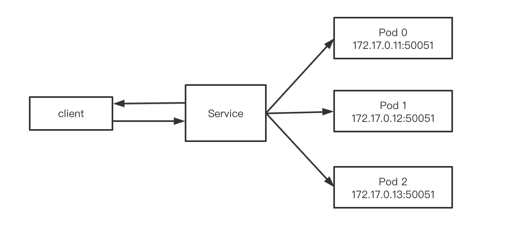

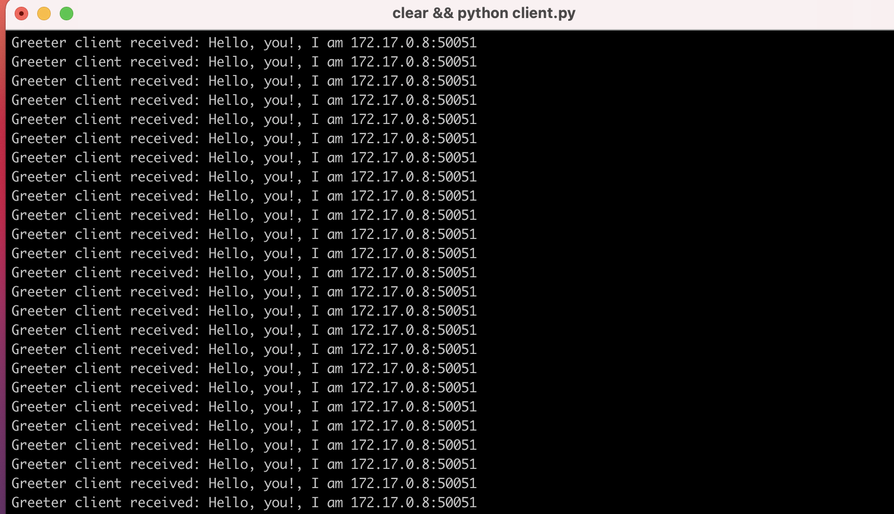

### 手动删除 deployment 中的 pod

使用 deployment 管理 pod，pod 的副本数是 3，service 连接该 deployment 下的所有 pod。

demo-deployment.yaml:

```yaml
apiVersion: apps/v1
kind: Deployment
metadata:
  name: demo-deployment
  labels:
    app: demo
spec:
  replicas: 3
  selector:
    matchLabels:
      app: demo
  template:
    metadata:
      labels:
        app: demo
    spec:
      containers:
      - name: demo
        image: grpc-lb-demo-server:latest
        imagePullPolicy: Never
        ports:
        - containerPort: 50051
        command: [ "python3", "server.py" ]
```

demo-service.yaml:

```yaml
apiVersion: v1
kind: Service
metadata:
  name: demo
spec:
  type: NodePort
  selector:
    app: demo
  ports:
    - port: 50051
      targetPort: 50051
      nodePort: 30051
```

pod 运行情况：

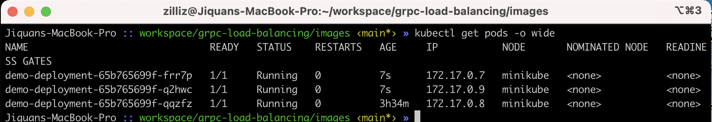

客户端连接情况：

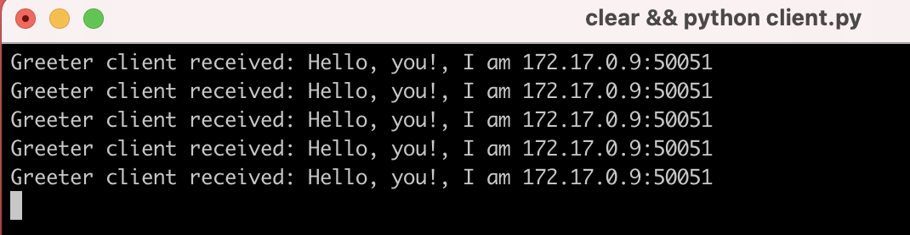

此时我们手动删除客户端连接到的 pod：

```shell
$ kubectl delete pod demo-deployment-65b765699f-q2hwc
```

该过程停顿了一段时间，并没有进行地很丝滑，相反，我删除其他 pod 倒非常地顺利，当终端提示我该 pod 删除完毕时，客户端报错连接失效，如下图所示：

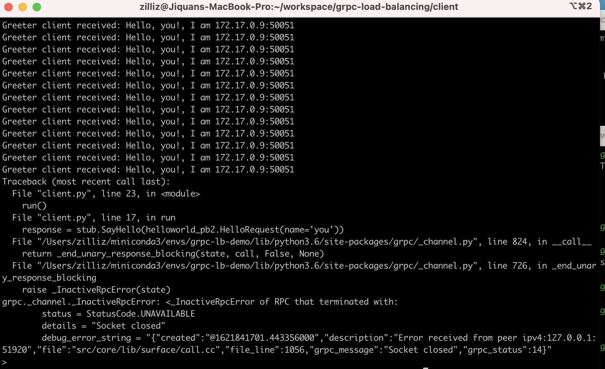

### deployment 扩缩容删除 pod

我们现在通过 deployment 的 scale 命令将 pod 的副本数从 3 缩减为 1：

```shell
$ kubectl scale deployment.v1.apps/demo-deployment --replicas=1
```

deployment 缩容时也分两种情况，第一种，客户端连接的 grpc 后端缩容后仍然被保留，此时，客户端连接情况没有任何变化。

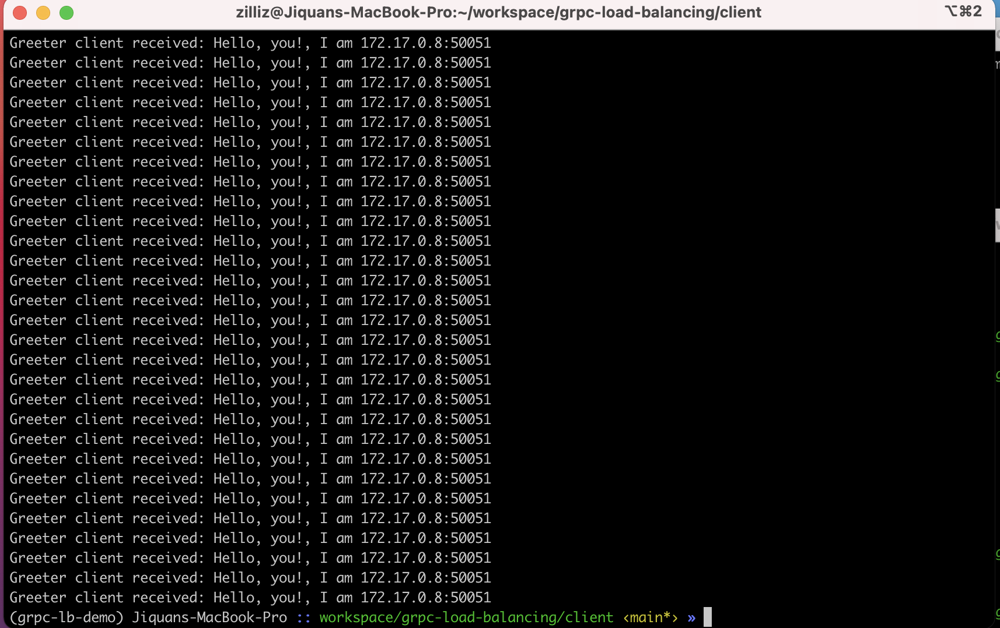

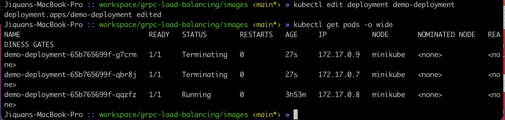

第二种情况，缩容后，客户端最开始连接的 grpc 后端被删除，此时我们发现客户端连接到了一个新的 grpc 后端（172.13.0.7 变成了 172.13.0.8）。

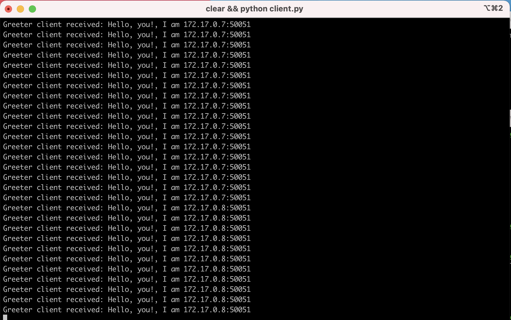

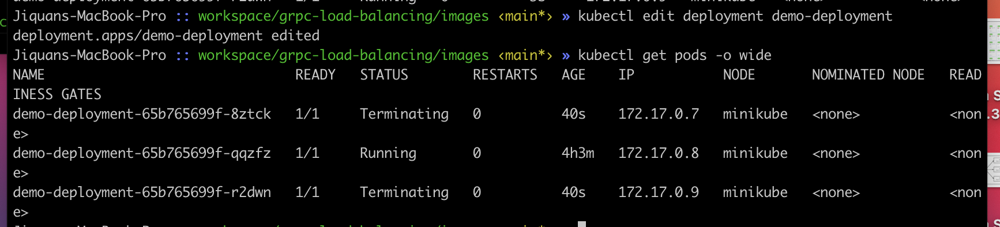

### 不使用 deployment，使用 service 直接管理 pod

如下图所示，手动起三个 pod 后端，Service 使用 selector ”app=lbdemo“ 连接到这三个 pod。

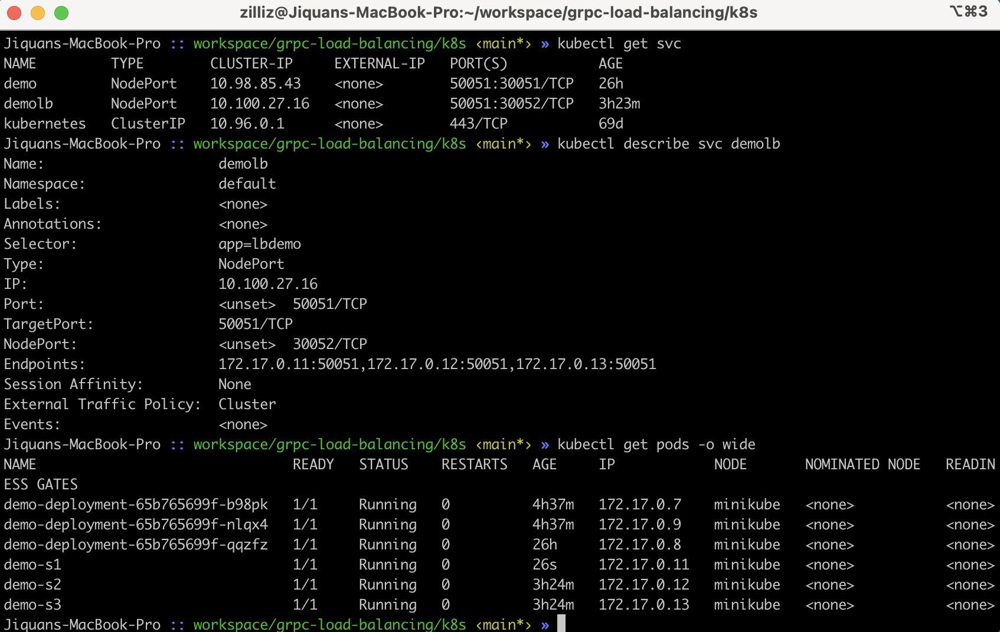

客户端的流量转发到了 172.13.0.7 这个 pod，此时我们强制删除该 pod，现象和上述直接删除 deployment 中的 pod 现象一致，等待一段时间终端才提示删除 pod 完成，然后客户端提示连接断开。

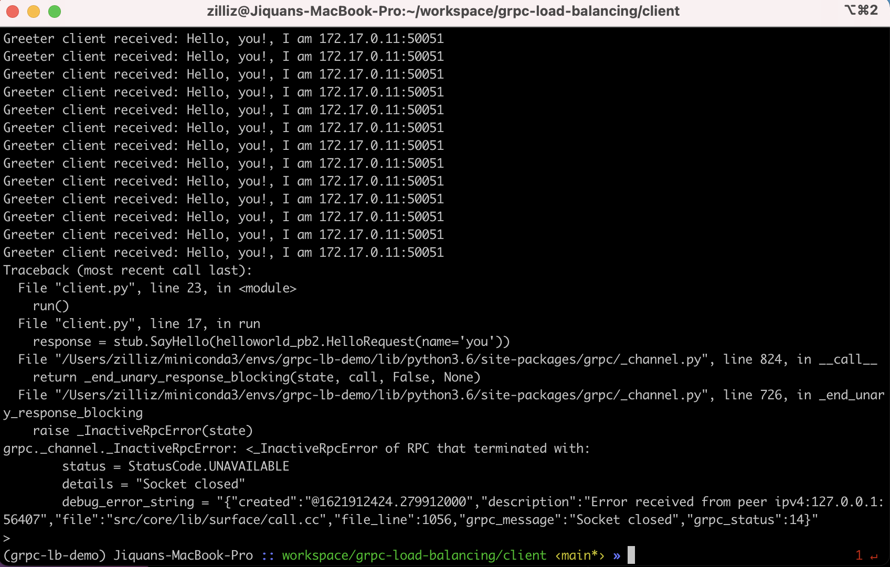

### TODO: 使用 ingress 配合 service 做 grpc 的负载均衡

k8s 支持使用 ingress 对 http 请求的各个层做定制化的负载均衡。

### TODO：其他相关的方案

1, [grpc load balancing use k8s service and linkerd](https://kubernetes.io/blog/2018/11/07/grpc-load-balancing-on-kubernetes-without-tears/)

### 来自同一台机器的多个客户端请求是否被转发到同一个后端？

先说结论：不会！为什么会有此一问？grpc 协议基于 http2，http2 是单个 tcp 长连接，所有请求都在该 tcp 连接上进行多路复用，这也解释了说为什么在上面的例子里面，同一个客户端发出的流量都被转发到了同一个后端。把该现象稍微延伸一下，多个客户端的连接请求是否会复用同一个 tcp 连接，同一个程序内的不同进程发起的客户端连接是否会共用同一个 tcp 连接，同一个进程内的不同线程发起的客户端连接是否会共用同一个 tcp 连接？本文只做了第一个验证，结论是不会。

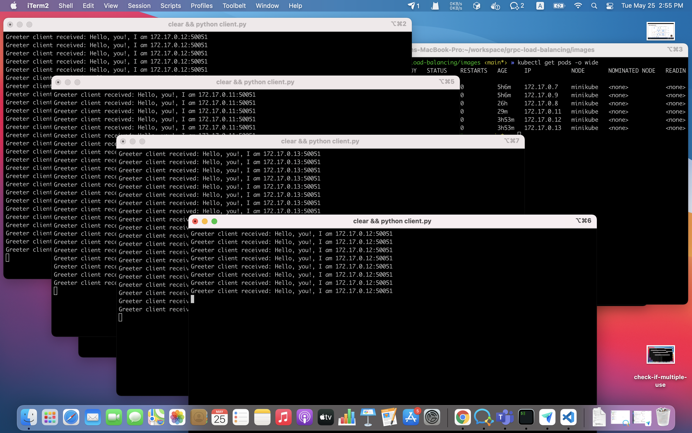

如图，四个终端起了四个客户端，四个客户端的流量分别被转发到了 172.13.0.12，172.13.0.11，172.13.0.13，172.13.0.12。

## TODO：借助 etcd 在 client 端做负载均衡

服务在启动之前，需要在 etcd 续租自己的 lease key，key 可以是由节点 mac 生成的唯一字符串（uuid），value 中存储节点的 ip 和 port，这些 lease key 具有同样的前缀，因此客户端可以在 etcd 中 watch 该前缀，该前缀对应 key 的变化对应服务节点的上下线，客户端根据这些变化动态创建以及删除相应节点的连接，在该连接池上再做一个负载均衡的策略，简单点可以随机分配连接，稍微智能点可以做一个优先队列，连接上负载越低的越容易被分配给新任务。

### TODO

不过该策略不适合在 k8s 上部署，节点注册的 ip 其实是 k8s 集群的虚拟 ip，只在集群内部才能被访问，显然让用户的客户端和服务在同一个集群是不太现实的。当然，我们也可以对节点的每一个 pod 做 port forward，这样虽然能解决集群外访问的问题，但是显然每一个运维人员都不会想去做这样的事情就是了。不过该方法可以在传统物理机上做验证，如果节点数不多的话。

## TODO：借助 etcd 在 server 端做负载均衡

原理和 client 端做负载均衡类似，client 端的请求首先发到 server，由 server 对该请求做负载均衡，路由到不同的节点。该方案的优点是适合在 k8s 上部署，因为此时 server 以及 服务节点在一个集群上，互相可以访问对方的虚拟 ip，还有一个好处是该方案不需要每一个客户端都实现负载均衡策略。当然，该方案下 server
容易形成单点瓶颈，而且中间也有一次转发的开销，对负载较重的场景不太友好（比如用户频繁插入，频繁发出结果集较大的请求）。

## 其他成熟的解决方案

- 1, istio
- 2, consul
- 3, linkerd

